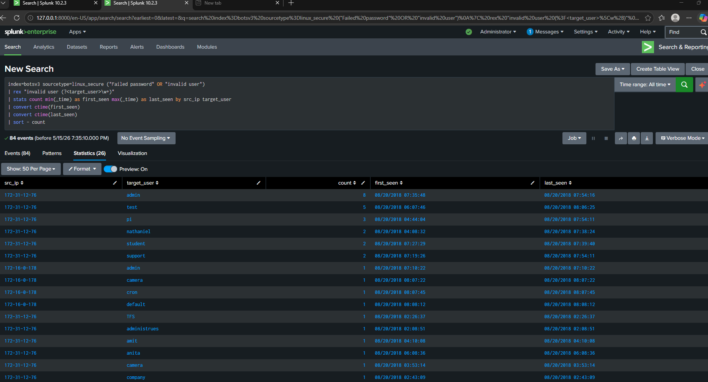

# SOC_LAB
Analyzing logs from firewalls, wazuh, splunk etc
# Project Name
SOC LAB
## Objective

Hands-on project focused on Linux, Security, Cloud, or Automation skills.

## Status

## Analysis

Investigation identified repeated SSH authentication failures originating from source IP address `172-31-12-76`.

The source attempted access against multiple common Linux usernames including:
- admin
- test
- pi
- student
- support

This behavior is consistent with brute-force or password spraying activity targeting SSH services.

Splunk statistical analysis showed repeated attempts across multiple usernames over time, indicating automated or scripted attack behavior.

# 📸 Detection Screenshots

## SSH Brute Force Detection

# 📊 Splunk Dashboard

The SOC Threat Monitoring Dashboard was created to visualize authentication attacks, monitor suspicious activity, and support threat detection workflows.

## Dashboard Features
- Top attacking IP addresses
- Most targeted usernames
- Authentication failures over time
- SSH brute-force monitoring

## Dashboard Preview

## Tools Used

Splunk, soc_lite

## Planned Features

* Build
* Secure
* Automate
* Document
