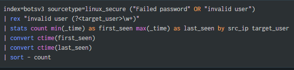

# Incident Report 001 – SSH Brute Force / Password Spray Attempt

## 📌 Incident Summary

A suspected SSH brute-force/password spraying attack was identified during analysis of Linux authentication logs within the BOTSv3 dataset using Splunk Enterprise.

The investigation detected repeated failed login attempts against multiple common Linux usernames originating from a single source IP address.

---

# 🛠️ Detection Method

The following SPL query was used to identify suspicious authentication activity:
## 🔎 SPL Query Used

Findings
Suspicious Source IP
172-31-12-76
Targeted Usernames
admin
test
pi
student
support
Observed Behavior
Multiple authentication failures
Repeated username enumeration
SSH login attempts across several accounts
Pattern consistent with automated password spraying or brute-force activity
📸 Detection Evidence
Splunk Statistical Analysis

🧠 Analysis

The source IP address demonstrated behavior commonly associated with brute-force or password spraying attacks targeting SSH services.

The attacker attempted authentication against multiple commonly used Linux account names over a period of time. This behavior suggests automated credential attacks or reconnaissance activity intended to identify weak or default credentials.

🛡️ MITRE ATT&CK Mapping
Tactic	Technique
Credential Access	T1110 – Brute Force
⚠️ Severity Assessment

Medium

Rationale:

Repeated authentication failures detected
Multiple account names targeted
Potential unauthorized access attempt
No confirmed successful compromise observed

✅ Recommended Actions
Block malicious source IP addresses
Enforce MFA for SSH access
Disable unused/default accounts
Implement SSH rate limiting
Review authentication logs for successful compromise attempts
Restrict public SSH exposure where possible
